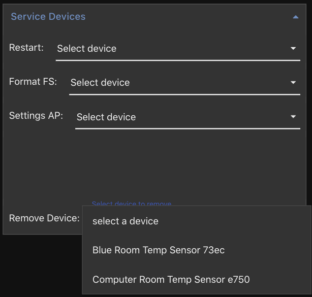

# WiFiMQTTManager

ESP32/ESP8266 library that encapsulates the WiFiManager and PubSub Client Libraries and adds the ability to save SSID, WiFi password, and MQTT connection settings so that they don't have to be hard-coded in your sketches.  Also allows for user friendly naming of your IoT devices and publishes device registration data back to a Node Red Dashboard where you can initiate service actions on your devices (e.g. restart, or bring up it's access point to reconfigure/rename device, etc) 

It's assumed that you already know how to setup an [Arduino development environment](https://www.arduino.cc/en/Guide/HomePage), including [how to install libraries](https://www.arduino.cc/en/Guide/Libraries), and that you already have [MQTT](https://mosquitto.org/download/) and [Node Red](https://nodered.org/docs/getting-started/)/[Dashboard](https://flows.nodered.org/node/node-red-dashboard) installed.  

First cut at a library. Contributions are welcome.

## Requirements

* [WiFiManager Library (must use development branch)](https://github.com/tzapu/WiFiManager/tree/development)
* [Arduino Json Library](https://github.com/bblanchon/ArduinoJson)
* [PubSub Client Library](https://github.com/knolleary/pubsubclient)
    + NOTE: Change MQTT_MAX_PACKET_SIZE in PubSubClient.h to 512 (at least)

## Dashboard

## Access Point Configuration

## Support
For issues, feature requests, comments or questions, use the [Github issues tracker](https://github.com/dreed47/WifiMQTTManager/issues).
